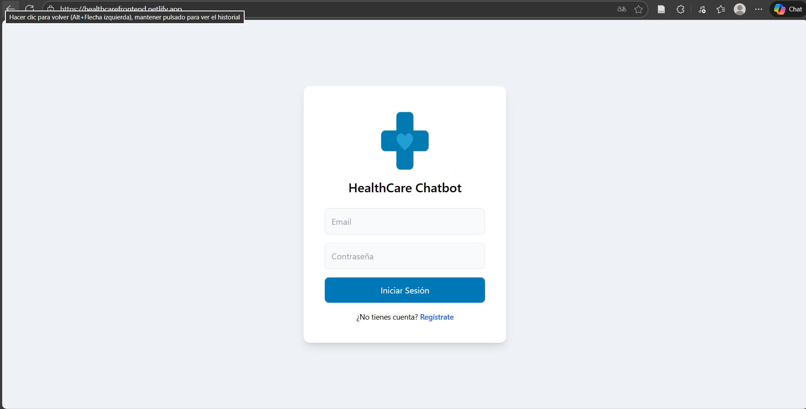
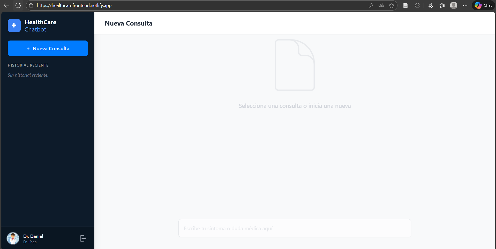
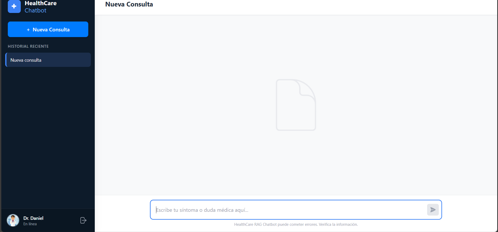

# 🩺 HEALTHCARE — Full-Stack Medical RAG Assistant


**Asistente médico conversacional inteligente basado en arquitectura RAG (Retrieval-Augmented Generation).**

Entrenado exclusivamente con documentos oficiales (**MINSA, OMS**) para proporcionar respuestas de primeros auxilios seguras, verificables y citadas, evitando alucinaciones mediante *Guardrails* médicos.

> 🚀 **DEMO EN VIVO:** [👉 **Prueba la aplicación aquí**](https://healthcarefrontend.netlify.app/)

---

## 📸 Capturas de Pantalla (Flujo de la App)

A continuación, el flujo completo de la aplicación: Login, Panel, Chat Médico y Verificación de Fuentes.

<p align="center">
  
  &nbsp;
  
  &nbsp;
  
  &nbsp;
  
</p>

---

## 🔗 Repositorios del Sistema (Microservicios)

El sistema sigue una arquitectura desacoplada desplegada en **Render** y **Azure**. El código fuente está dividido en los siguientes repositorios:

| Componente | Tecnologías Clave | Repositorio |
| :--- | :--- | :--- |
| **🖥️ Frontend** | React, Vite, Tailwind, Zustand | **[🔗 Ver Repo Frontend](https://github.com/Daniel-Loli/healthcare-frontend.git)** |
| **🛡️ Backend Gateway** | Node.js, Express, JWT, Azure SQL | **[🔗 Ver Repo Node.js](https://github.com/Daniel-Loli/healthcare-backend.git)** |
| **🧠 Backend IA Engine** | FastAPI, LangChain, Azure Search | **[🔗 Ver Repo Python IA](https://github.com/Daniel-Loli/healthcare-backend-ia.git)** |
| **⚡ Indexador** | Azure Functions (BlobTrigger) | **[🔗 Ver Repo Functions](https://github.com/Daniel-Loli/healthcare-indexer.git)** |

---

## 🏗️ Arquitectura del Sistema

El flujo implementa un patrón **RAG (Retrieval-Augmented Generation)** con una capa de seguridad en Node.js y persistencia en SQL.

```mermaid
graph TD
    User[👤 Usuario] -->|HTTPS| Front[💻 React Frontend]
    Front -->|REST / JWT| Gateway[🛡️ Node.js API Gateway]
    Gateway -->|Auth & History| SQL[(🗄️ Azure SQL)]
    Gateway -->|Consulta Médica| Engine[🧠 FastAPI RAG Engine]
    
    subgraph "Nube Azure AI"
        Engine -->|Vector Search| Search[🔎 Azure Cognitive Search]
        Engine -->|Generación| OpenAI[🤖 Azure OpenAI GPT-4o]
        Blob[📄 Azure Blob Storage] -->|Trigger| Func[⚡ Azure Function]
        Func -->|Indexación Auto| Search
    end
